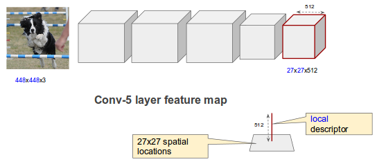

# Generating feature encodings using deep CNNs

## Overview

We use this code to generate CNN features on Flickr8k images using Imagenet pre-trained CNNs from VGG.
Since Flickr8k images do not have class labels, it is not possible to directly fine-tune a network on them. 
We therefore use a Gaussian Mixture Model to adapt to the Flickr8k images in an unsupervised manner, and then 
use Fisher Vector encoding to get features that are, hopefully, more adapted to the Flickr8k dataset than the 
original Imagenet pre-trained network features. This is under the assumption that there is a sufficient shift 
in domain between Imagenet and Flickr. 

### CNN features as Local descriptors

The features from an intermediate convolutional layer can be regarded as a $H \times W \times K$ tensor, as 
shown in the figure above. Here, $K = 512$, denoting the number of channels or features for this feature map.
$H$ and $W$ in this example are both 27, as we use 448x448 images as input and extract features from the $relu-5$ 
layer of a VGG-16 model.

### Spatial information

Since many descriptions of images are closely related to spatial location (e.g. "the dog jumped *over* the bar"), 
including explicit positional information by appending (x,y) coordinates to features is done here.

## Results
 

## Code description

This code simply extracts the features at various settings (details below). The training of LSTMs to perform 
image captioning on the FV-CNN and regular CNN features is the next step (*not in this repo* at present).

The repository contains code using VLFEAT and MATCONVNET to:

+ Train CNNs models from scratch or fine-tune on datasets
+ Extract a vareity of CNNs features including:
	+ R-CNN : features from CNNs at various layers
	+ D-CNN : CNN filterbanks with Fisher Vector pooling
	+ B-CNN : bilinear CNN
+ Run experiments on variety of datasets.

	

## Acknowledgements
The base code is taken from the Bilinear CNN project by Tsung-Yu Lin, Aruni RoyChowdhury and Subhransu Maji at UMass Amherst.

	

