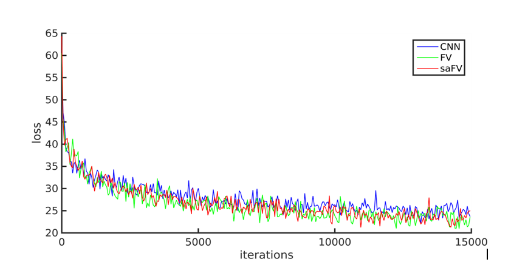
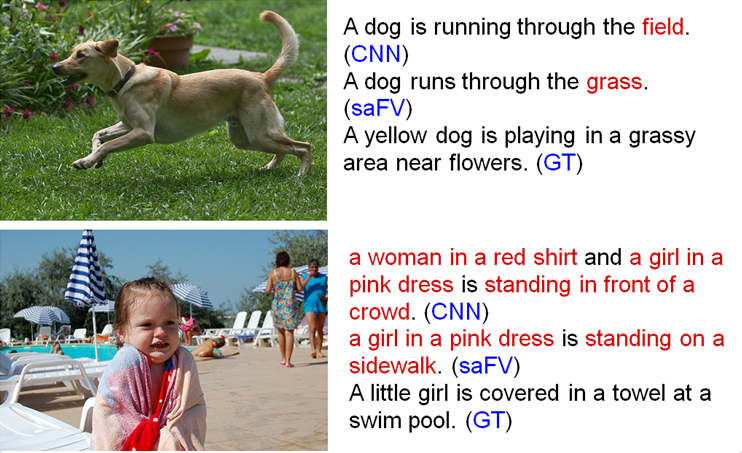

# Improving deep CNN image encodings for caption generation

## Overview

We use this code to generate CNN features on Flickr8k images using ImageNet pre-
trained CNNs from VGG. Since Flickr8k images do not have class labels, it is not
possible to directly fine-tune a network on them  using the usual classification
loss and a low learning rate.
 
We therefore use a Gaussian Mixture Model to adapt to the Flickr8k images in an
unsupervised manner, and then  use Fisher Vector encoding to get features that
are, hopefully, more adapted to the Flickr8k dataset than the  original ImageNet
pre-trained network features. This is under the assumption that there is a
sufficient shift  in domain between ImageNet and Flickr. We also explore how 
the orderless pooling stage of models like Fisher Vectors can cause a drop in 
performance by discarding spatial information and how this can be overcome by 
explicitly including rough spatial information in the local features.

## Code description

The repository contains MATLAB code using VLFEAT and [MATCONVNET
beta9](http://www.vlfeat.org/matconvnet/download/)  to extract the Fisher Vector
features at various settings in the `run_experiment.m` script.

Unfortunately, we have not been able to clean up and upload the training code of
LSTMs to perform image captioning on the visual features. It is essentially just
replacing the VGG-16 features with our features and running Andrej Karpathy's
training  code taken from the [Neuraltalk2 repo](https://github.com/karpathy/neuraltalk2).

### CNN features as Local descriptors

The features from an intermediate convolutional layer can be regarded as a _H x
W x D_ tensor, as  shown in the figure above. Here, _D_ = 512, denoting the
number of channels or features for this feature map. _H_ and _W_ in this example
are both 27, as we use 448x448 images as input and extract features from the
`relu-5`  layer (`conv-5` followed by `ReLU` non-linearity) of a VGG-16 CNN model.

The [Fisher Vector model](http://www.vlfeat.org/api/fisher-fundamentals.html)
aggregates these features across  the spatial dimensions, resulting in a _2*K*D_
vector. Here _K_=64 is the number of Gaussians in the GMM. Essentially, it is a 
way of aggregating the _27x27_ spatially distributed features into a single 
vector. This is "orderless" in the sense that the spatial positions of the local 
features do not matter during the pooling step.

### Spatial information

Since many textual descriptions of images are closely related to spatial
location (e.g. *"the dog jumped **over** the bar"*),  including explicit positional
information by appending 2D positional coordinates to features is done here.
These coordinates are the centers of the receptive fields of the network filters
measured w.r.t. the input image's  dimensions. This has been shown to improve 
performance in tasks where the spatial locations of objects parts is important, 
e.g. face verification using [Fisher Vector faces](http://www.robots.ox.ac.uk/~vgg/publications/2013/Simonyan13/).

## Experiments

Our implementation was segmented into two parts, the Fisher Vector Convolutional
Neural Network (FV-CNN) and the Long Short Term Memory(LSTM) network. We used
[MatConvNet toolbox (beta9)](http://www.vlfeat.org/matconvnet/download/) to
generate the CNN (VGG-16) and FV-CNN descriptors.

We used the Python library [NeuralTalk](https://github.com/karpathy/neuraltalk2)
to implement the LSTM.

We use the CNN outputs of the last hidden layer to  estimate the Gaussian
Mixture Model for Fisher encodings (**FV**).

For our *spatially augmented* Fisher CNN (**saFV**), we also augment the spatial
co-ordinates to the CNN output vector.

The baseline for us is just using the VGG-16 features at the fully-connected
layer (**CNN**).

The **LSTM Network** consists of a single layer with a dimensionality of 256.  
A softmax activation is used to predict words at a position one by one.

### Dataset description

We chose the [Flickr8k](http://nlp.cs.illinois.edu/HockenmaierGroup/Framing_Image_Description/KCCA.html)  dataset of eight thousand images. The images in this
data set focus on people or animals (mainly dogs) performing some action. The
images were cho- sen from six different Flickr groups (*Kids in Action, Dogs in
Action, Outdoor Activities, Action Photography, Flickr-Social*) and tend not to
contain any well-known people or locations, but were manually selected to depict
a variety of scenes and situations. We divide the data set into 6k training
images, 1k validation images and 1k testing images. Each image is annotated with
five different reference sentences.
 

### Training

We use batch size of 100 sentences for the LSTM training. Each model is trained
for 50 epochs. The training loss for each batch for LSTM training is shown in
the figure above. We calculate perplexity on the validation dataset for each
epoch. The trained model after a particular epoch is saved if the validation
perplexity for that epoch is lower than any of the previous epochs. Finally, we
use the model with the lowest recorded validation perplexity to calculate the
BLEU scores on the test set.

## Results

 We evaluated original CNN (`CNN`), FV-CNN (`FV`) and spatially-augmented
FV-CNN (`FV+(x,y)`) on the Flickr8k data set. The evaluation metric used was the
commonly used BLEU (Bilingual Evaluation Understudy) scores.

| Model         | BLEU-1        | BLEU-2       |  BLEU-3       | BLEU-4        |
| ------------- |:-------------:|:------------:|:-------------:|:-------------:|
| CNN           |  56.3    		|	38.0       |    24.6       |   16.2        |
| FV 			|  55.2    		|	37.1	   |    24.1       |   15.8        |
| Fv+(x,y)      |  **57.8**		| **39.0**     |   **25.3**    |  **16.4**     |

The VGG-16 CNN output at `relu-7` layer as the descriptor for the input image
provides us a  standard baseline to compare against.

The FV encoding aggregates the mid-level CNN features (`relu-5` layer) over _W_
and _H_. This aggregation  results in a loss of spatial information, which can
be seen by slightly lower scores of FV versus CNN. In other words, what we may
gain by the unsupervised feature adaptation to Flicker8k images is lost by the
loss of spatial information.

The spatially-augmented FV encoding managed to retain both rough spatial
information and benefit from the  unsupervised adaptation step of the GMM of the
Fisher Vector model being trained on the Flicker8k domain.

Some qualitative examples of our captions are shown below:

	

## Acknowledgements

This was a term project done by  
[Abhyuday Jagannatha](https://people.cs.umass.edu/~abhyuday/), 
[Aruni RoyChowdhury](http://people.cs.umass.edu/~arunirc/),  
[Huaizu Jiang](https://people.cs.umass.edu/~hzjiang/) and Weilong Hu for the 
[Deep Learning seminar](https://people.cs.umass.edu/~mahadeva/CMPSCI_697_Deep_Learning/Welcome.html) 
at UMass Amherst in **Fall 2015**.

The report we submitted can be accessed [here (PDF)](downloads/DL_report_final_aahw.pdf).

The base MATLAB code for Fisher Vector encoding of CNN features is taken from  the 
[Bilinear CNN project](http://vis-www.cs.umass.edu/bcnn/) 
by Tsung-Yu Lin, Aruni RoyChowdhury and Subhransu Maji at UMass Amherst.

	

